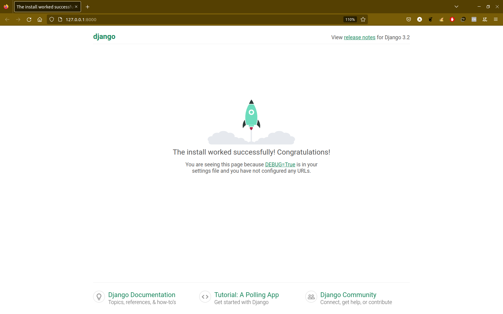

## Django 3.2.15

To start default app in my local (venv_Django): `python manage.py runserver`:
<p align="center">

</p>

To create admin (superuser): `python manage.py createsuperuser`:
```commandline
Имя пользователя (leave blank to use 'ankiav'): 
Адрес электронной почты: anklavvanlove@gmail.com
Password: 
Password (again): 
Введённый пароль слишком короткий. Он должен содержать как минимум 8 символов.
Введённый пароль состоит только из цифр.
Bypass password validation and create user anyway? [y/N]: y
Superuser created successfully.
``` 

### After creating Model:

To apply migration: `python manage.py makemigrations` in Terminal.

And then to migrate our DB to project: `python manage.py migrate` in Terminal.

Added admin page and in its added row in table Users:
<p align="center">

</p>

## Troubleshooting:
1. During development, I encountered an import problem - I could not correctly import internal modules in the program: to solve it, I needed to set the main directory of the **Django_HW** project as **Sources Root**.
2. TemplateDoesNotExist at / index.html: need to go _settings.py_ > `TEMPLATES = [...'DIRS': [BASE_DIR/'templates'],...]`.
