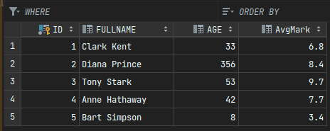
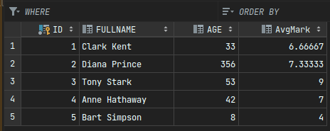
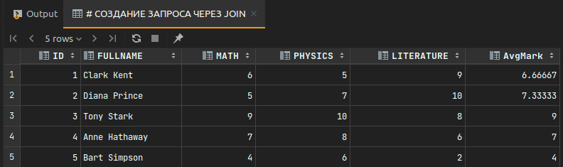

### Task 1:

**_RU_**: Создать БД с двумя таблицами, соединить их JOIN'ом.
**_EN_**: Create a database with two tables, join them with a JOIN.
---
## Result:
I made 2 tables. 
Then i updated first table with new averege mark with data on second table:
     
    UPDATE STUDENTS, PROGRESS
        SET STUDENTS.AvgMark = (PROGRESS.MATH + PROGRESS.PHYSICS + PROGRESS.LITERATURE) / 3
    WHERE STUDENTS.ID = PROGRESS.StudentID
* First table before update:

* After update:

Then I used INNER JOIN:

    SELECT S.ID, S.FULLNAME, P.MATH, P.PHYSICS, P.LITERATURE, S.AvgMark
    FROM STUDENTS S
    INNER JOIN PROGRESS P on S.ID = P.StudentID
This is result of its:

