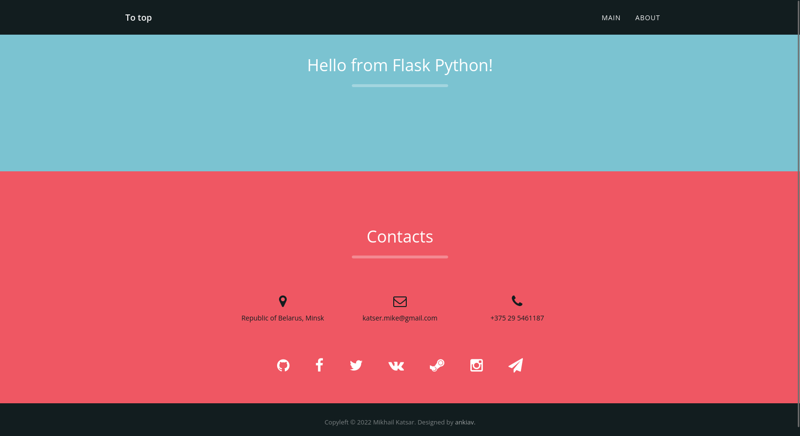

# Task 1:
## Create a Flask app with two endpoints.

--
## Result:

I made 2 endpoints:
- first - the main page _/_ and _/home_
- second - my old project about html5 _/about_

I've connected this pages with links with Navigation Bar.

To return html-page uses _render_template()_ function from _flask_.

```python
from flask import Flask
from flask import render_template, url_for
```

So, after run app.py we can see:
```diff
- * Serving Flask app 'app'
-  * Debug mode: on
-   app.env = "ankiav working hard!"
- WARNING: This is a development server. Do not use it in a production deployment. Use a production WSGI server instead.
-  * Running on http://127.0.0.1:5000
- Press CTRL+C to quit
-  * Restarting with stat
-   app.env = "ankiav working hard!"
-  * Debugger is active!
-  * Debugger PIN: 112-053-365
```

Web-page on address `http://127.0.0.1:5000/` on my desktop PC:
<p align="center">

</p>
